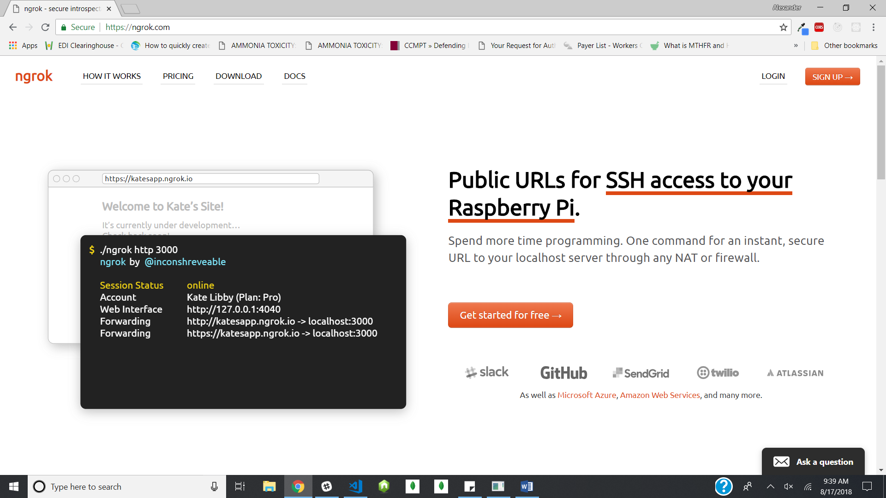
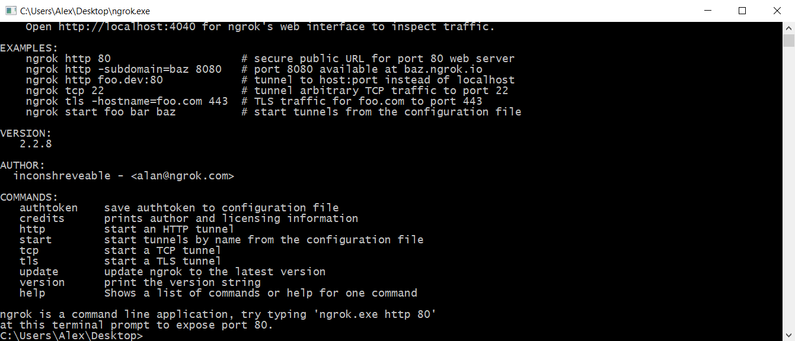
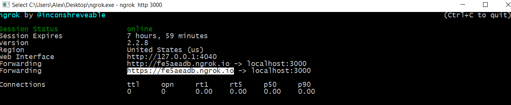

# ORIGIN MOBILE APP <sup>v1.0</sup>

<p align="center">
  
</p>

## PREREQUISITES:
1. Install MongoD and Mongo
2. Install Expo XDE on your computer
3. Install Expo App on your mobile phone

# STEP 1: Clone the Origin Mobile App 
Clone the Origin Mobile App which will create an origin-mobile-app folder 
```sh
$ git clone git@github.com:OriginCodeAcademy/origin-mobile-app.git
```
# STEP 2: NPM install in both the root and app directories

```sh
$ origin-mobile-app>npm install
$ origin-mobile-app\app>npm install
```

# STEP 3: Install ngrok in order to change direct routes to your localhost
1. Download [Ngrok](https://ngrok.com) and "Sign Up" for an account



2. Unzip/Extract the downloaded .exe file.
3. Right click on the unzipped ngrok to open the ngrok command line

 

4. MAC ONLY - Obtaining a localhost URL
    * 4a. - in the command line, type: ./ngrok authtoken "enter token number that was assigned to you when you signed up for ngrok"
    * 4b - in the command line, type: ./ngrok http 3000 (to use port 3000 or replace 3000 with any other of your choosing)
5. WINDOWS ONLY - Obtaining a localhost URL
    * 4a - in the command line, type ./ngrok http 3000 (to use port 3000 or replace 3000 with any other of your choosing)



6. Copy the URL provided by ngrok and replace the path where local API calls will be made. Currently, the following 8 lines will need to be updated (this will change as the app grows and should be documented accordingly):

| File | Lines |
| ---- | ----- |
| CheckInActions.js | Lines [7](https://github.com/OriginCodeAcademy/origin-mobile-app/blob/a7514e1d5c0ccfcafb420b62ae5e4bac8e63f7ed/app/Containers/CheckIn/CheckInActions.js#L7) & [38](https://github.com/OriginCodeAcademy/origin-mobile-app/blob/a7514e1d5c0ccfcafb420b62ae5e4bac8e63f7ed/app/Containers/CheckIn/CheckInActions.js#L38https://github.com/OriginCodeAcademy/origin-mobile-app/blob/a7514e1d5c0ccfcafb420b62ae5e4bac8e63f7ed/app/Containers/CheckIn/CheckInActions.js#L38) |
| LoginActions.js | Lines [12](https://github.com/OriginCodeAcademy/origin-mobile-app/blob/a02e86dbc07e1538fae838afcedb9287158016ae/app/Containers/Login/LoginActions.js#L12https://github.com/OriginCodeAcademy/origin-mobile-app/blob/a02e86dbc07e1538fae838afcedb9287158016ae/app/Containers/Login/LoginActions.js#L12) & [16](https://github.com/OriginCodeAcademy/origin-mobile-app/blob/a02e86dbc07e1538fae838afcedb9287158016ae/app/Containers/Login/LoginActions.js#L16) |
| RegisterActions.js | Lines [65](https://github.com/OriginCodeAcademy/origin-mobile-app/blob/a02e86dbc07e1538fae838afcedb9287158016ae/app/Containers/Register/RegisterActions.js#L65) & [74](https://github.com/OriginCodeAcademy/origin-mobile-app/blob/a02e86dbc07e1538fae838afcedb9287158016ae/app/Containers/Register/RegisterActions.js#L74) |
| server.js | Lines [29](https://github.com/OriginCodeAcademy/origin-mobile-app/blob/a02e86dbc07e1538fae838afcedb9287158016ae/server/server.js#L29) & [53](https://github.com/OriginCodeAcademy/origin-mobile-app/blob/a02e86dbc07e1538fae838afcedb9287158016ae/server/server.js#L53) |

* Example with new ngrok provided from above screenshot
~~~~
        payload: axios.get('https://fe5aeadb.ngrok.io/register', {    
            params: {
                studentId: newUserReg.studentId,
                email: newUserReg.email
            }
        })
~~~~

# STEP 4: Testing
1. Start MondoD and then Mongo
2. npm start

```sh
$ origin-mobile-app>npm start
```
4. Start Expo XDE on your computer
5. Start Expo on your mobile phone
6. The app is not functional on you mobile phone
